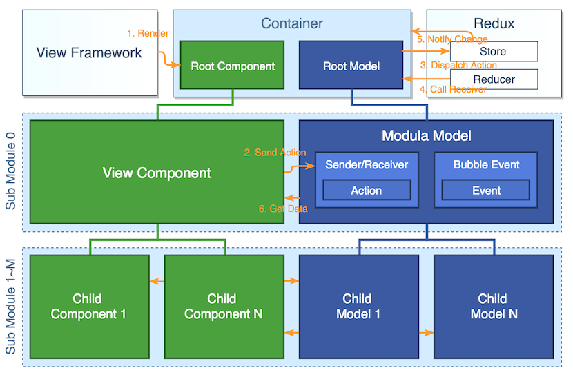
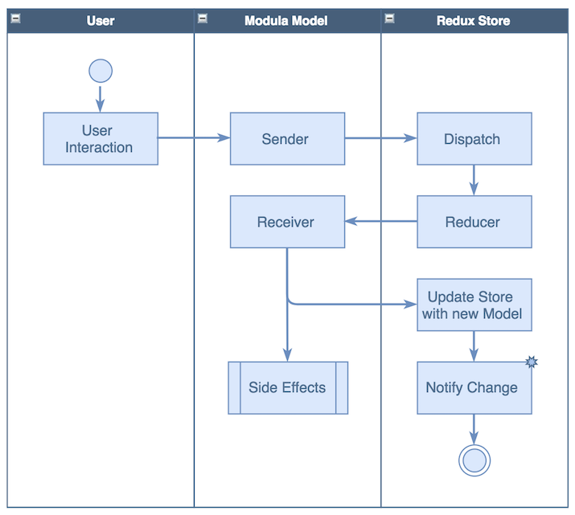

The central piece of front end today is about managing state. ModulaJS is created to provide an intuitive and simple way of manage complex state.

Here are some basic state management concepts that you may rarely heard of, but they're the laws ModulaJS is built upon:

- __Application State__ = __Initial State__ + __Deltas__, where __Delta__ are triggered by __Actions__ [ originated from Flux, Elm ]
- __Application State__ can be expressed by a __Model Tree__, where each node of the tree is also a __Model__ representing a valid business entity [ originated from Redux, Elm ]
- __Possible Transitions__ from a given __Application State__ to another could be expressed by a list of __Reactions__ provided by the __Model Tree__, a successful match of __Action__ and __Reaction__ will evolve the __Model Tree__ to the next state [ original ]
- __Side Effect__ is the result of state transitions, it includes an updated model, as well as zero to many callback functions [ originated from Elm ]

## Architecture

For a certain front end app built with ModulaJS, there should be a single **Store** at root level, and the Store contains a **ModulaJS model tree**.

The component tree and ModulaJS model tree can have similar structure, usually each model node in model tree is associated with one or multiple corresponding component nodes in component tree at the corresponding depth, but not all component nodes are associated with a corresponding model node. As a result, ModulaJS model tree is usually simpler than component tree, which implies a certain level of abstraction.

A **ModulaJS Model** holds the state of current page (or part of the page).
A model has a list of attributes, and the attribute value can be an instance of another model, sometimes a list of other model instances, using this simple composition method eventually we are able to represent the whole page in a single model tree.

The model is strictly immutable, which means making any change to the model would create a new version of the model, which has different object pointer comparing to previous one.
The most typical calls that can change model are `set(key, value)` or `setMulti({ key1: value1, key2: value2 })`, as mentioned earlier, will return a new version of the model.

In typical ModulaJS apps, the state of a page is represent by a single root model.
In order to update some node, we always have to go through the "Action -> Dispatch -> Root Model -> locate the handling model -> Return updated handling model -> Return updated root model" cycle.
Fortunately, we don't need to worry about those details. Instead we define sender methods to express the intent of change and receiver methods to define the reaction when receiving the change.

There are some more concepts we need to know, like **Context**, **Side Effects**, **Events** etc., for further details refer to the [Model API](api/model_api.md).

### Data Flow

Here's how the data flows throughout the system:

1. Store is initialized with a Root Model.
2. An user action on child component invokes a specific sender function of its model.
3. Sender function dispatches an Action which is then sent to the root reducer.
4. Root Reducer finds a Receiver base on the Action type and where it's dispatched, then delegate to the model who dispatched the action to handle the update, which return a new immutable model instance.
5. The update bubbles up until root model is also updated (immutability means when child is updated the parent would also be updated).
6. Root Component is notified and the view rendering process is kicked off given the new root model as the state.

Beyond the main Data Flow, a receiver's `update()` function can also return **Side Effect** functions along with new model instance. A **Side Effect** function can be either another Sender or a function firing **Bubble Event**.
